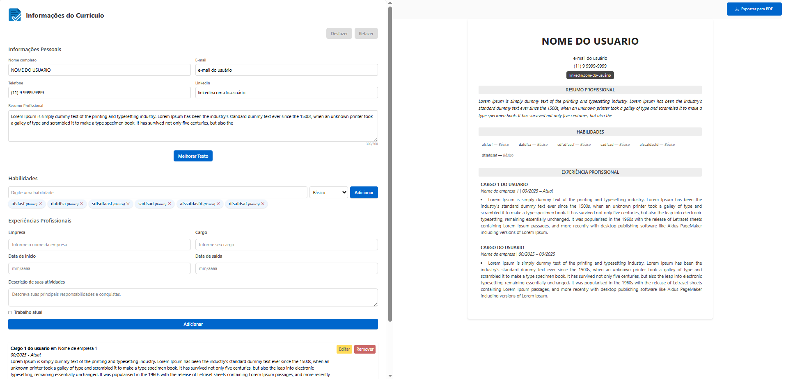

# CV Builder AI 🚀

Gerador de Currículos Inteligente com preview em tempo real e melhorias por IA. 
 
Projeto desenvolvido como parte do Programa Desenvolve.

    



---

## 👥 Equipe
- Celso  
- Felype  
- July  
- Marcia  
- Paulo  

---

## 🌟 Funcionalidades

### Principais
- Formulário completo para dados pessoais, habilidades e experiências  
- Preview do currículo atualizado em tempo real  
- Botões para melhorar textos automaticamente com IA  
- Validações em tempo real (campos obrigatórios, datas, etc.)  
- Interface clean e moderna  

### Extras
- Exportar currículo em PDF com layout profissional  
- Persistência de dados no `localStorage`  

---

## 🛠️ Tecnologias Utilizadas
- **React 19**  
- **TypeScript**  
- **Vite**  
- **TailwindCSS v4**  
- **OpenAI API**  

---

## 🖼️ Como Usar

1. Clone este repositório e instale as dependências:

```bash
git clone https://github.com/seu-usuario/curriculo-facil-generator.git
cd curriculo-facil-generator
npm install
```

2. Adicione sua chave da API no arquivo .env na raiz do projeto

3. Inicie o servidor de desenvolvimento:

```bash
npm run dev
```

4. Abra no navegador em http://localhost:3000

---

📄 Exportar Currículo

- Clique no botão de Exportar PDF

- Currículo será gerado com layout profissional pronto para impressão ou envio

💡 Dica: Atualize seus textos com o auxílio da IA para criar currículos mais atrativos e personalizados!